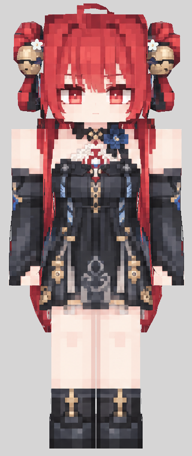
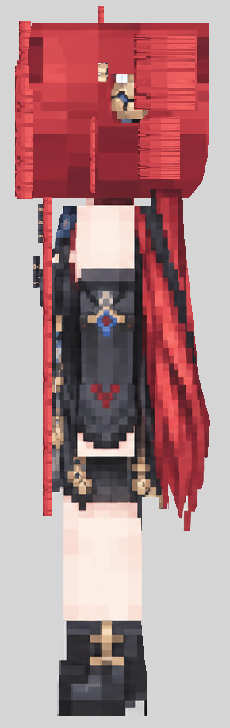
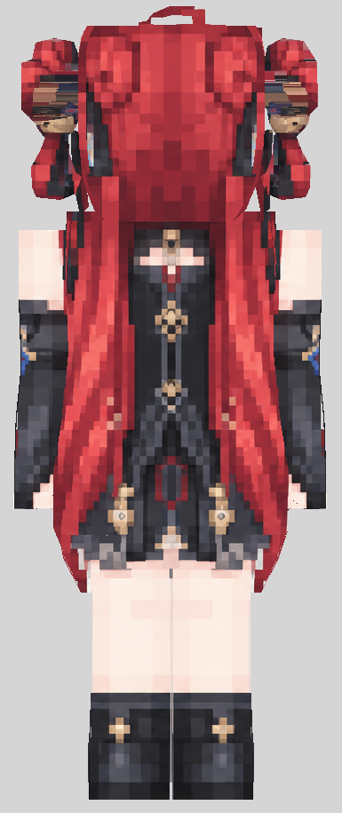

# Suoming (锁暝) · Minecraft Figura Avatar

A fan-made Figura avatar based on the supplied front, side, and back references. It has layered red hair, hair ornaments, a detailed outfit, skirt panels, and a corrected head texture that does not show an extra eye on the side.

| Front | Side | Back |
| --- | --- | --- |
|  |  |  |

## Download and install

1. Download [红发角色_Figura_头侧修正版.zip](红发角色_Figura_头侧修正版.zip).
2. Extract the ZIP. Place the included `红发角色_原图还原版_Figura` folder in your Minecraft Java instance's `figura/avatars/` directory.
3. In Figura, select **红发角色 · 原图还原版**. If Minecraft is already running, refresh the avatar list.

The resulting path should contain `figura/avatars/红发角色_原图还原版_Figura/avatar.json` directly. This is a Figura custom avatar; `texture.png` is a 2048 × 2048 model texture and cannot be uploaded as a standard 64 × 64 Minecraft skin.

## Files

- `model.bbmodel`: editable Blockbench model with embedded texture.
- `texture.png`: model texture.
- `avatar.json`, `script.lua`, `avatar.png`: Figura avatar configuration, script, and icon.
- `使用说明.md`: detailed Chinese installation notes and current limitations.
- `模型_正面.png`, `模型_侧面.png`, `模型_背面.png`: rendered views of the delivered model.
- `红发角色_Figura_头侧修正版.zip`: ready-to-install avatar folder.

The model and texture have been checked for geometry, texture references, body-part bindings, and movement previews. The avatar has **not yet been tested inside a Minecraft client**. Lighting in game may look different from the renders.

ZIP SHA-256: `5F3903B2687BC9FD88122F31D93C322AFD6C6186C03C93999EA61C232EE336BF`

This is an unofficial fan project and is not affiliated with the Wuthering Waves creators.
