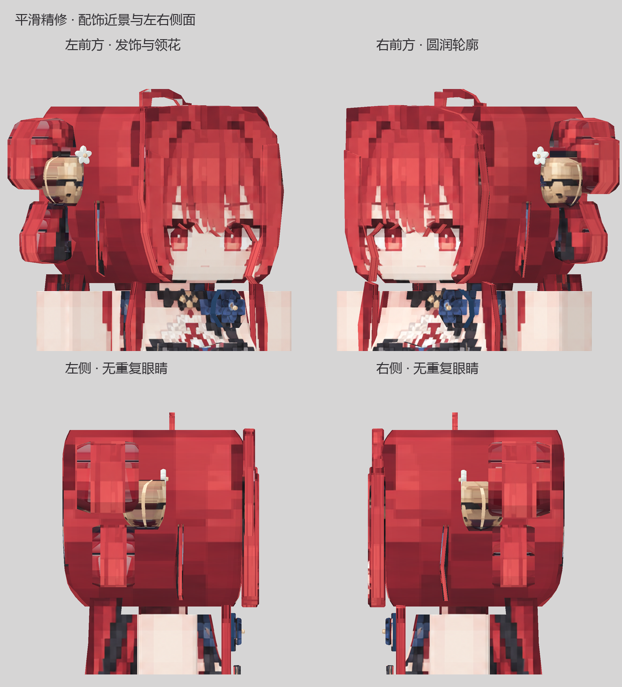

# Suoming (锁暝) · Minecraft Figura Avatar

A fan-made Figura avatar based on the supplied front, side, and back references. It has layered red hair, hair ornaments, a detailed outfit, skirt panels, and corrected head side textures without duplicate eyes.

## Smooth detail update

The head, body, limbs and boots now have rounded cross-sections and softer contour transitions. Bells have curved volumes; hair buns, fringe and loops have beveled edges. White blossoms have separate petals and centers, the blue collar flower has layered petals, and ribbons have a gentle bend. Ornament UVs were repaired to remove background and overlapping objects baked into the reference.

The delivered model has 54 mesh parts, 3,770 faces and 6,648 rendered triangles. Redundant rings were removed while keeping contour changes below one third of a reference pixel. Both head side walls remain free of eye textures.

| Front | Side | Back |
| --- | --- | --- |
|  |  |  |

## Download and install

1. Download the updated [Figura avatar ZIP](红发角色_Figura_头侧修正版.zip). The existing filename is retained so previous download links continue to work.
2. Extract the ZIP. Place the included `红发角色_原图还原版_Figura` folder in your Minecraft Java instance's `figura/avatars/` directory, replacing the previous version if installed.
3. In Figura, select **红发角色 · 原图还原版**. If Minecraft is already running, refresh the avatar list.

The resulting path should contain `figura/avatars/红发角色_原图还原版_Figura/avatar.json` directly. This is a Figura custom avatar; `texture.png` is a 2048 × 2048 model texture and cannot be uploaded as a standard 64 × 64 Minecraft skin.

## Files and validation

- `model.bbmodel`: editable Blockbench model with embedded texture.
- `texture.png`: model texture.
- `avatar.json`, `script.lua`, `avatar.png`: Figura avatar configuration, script, and icon.
- `使用说明.md`: detailed Chinese installation notes and current limitations.
- `模型_正面.png`, `模型_侧面.png`, `模型_背面.png`: rendered views of the delivered model.
- `平滑精修_细节与侧面.png`: close-ups rendered from the same model and texture.
- `红发角色_Figura_头侧修正版.zip`: ready-to-install avatar folder.

Geometry, closed meshes, texture references, UV bounds, body-part bindings, both head side walls and two movement previews were checked. The avatar has **not yet been tested inside a Minecraft client**. Lighting and performance in game still need to be confirmed.

ZIP SHA-256: `A3488D0ACFA33AF453EFB1ACC22CE5852134B7C9FF1E8FC6B662738E896B92DC`

This is an unofficial fan project and is not affiliated with the Wuthering Waves creators.
